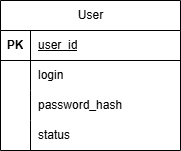

**Вариант №1. Сервис аутентификации.**

**1\. Добавить пользователя (регистрация)**  
Информация требуемая для создания пользователя

| Параметр | Пояснение | Обязательность | Тип | Ограничение | Значение по умолчанию |
| ----- | ----- | ----- | ----- | ----- | ----- |
| login | Логин | Обязательно | Строка | Уникальный, от 3 до 50 символов, только латиница, цифры и \_ |  |
| password | Пароль | Обязательно | Строка | Не менее 8 символов |  |

**Уникальные комбинации параметров:**

* Логин  
* id пользователя

**Выходные данные**

Информация возвращаемая в случае удачного создания пользователя

| Параметр | Пояснение | Тип |
| :---- | :---- | :---- |
| user\_id | id пользователя | Целое число |
| login | Логин | Строка |

**2\. Вход в учетную запись**  
**Информация требуемая для входа в систему**

| Параметр | Пояснение | Обязательность | Тип | Ограничение | Значение по умолчанию |
| :---- | :---- | :---- | :---- | :---- | :---- |
| login | Логин | Обязательно | Строка |  |  |
| password | Пароль | Обязательно | Строка |  |  |

**Выходные данные**  
Информация, возвращаемая в случае удачного входа

| Параметр | Пояснение | Тип |
| :---- | :---- | :---- |
| access\_token | Токен доступа | Строка (JWT) |
| refresh\_token | Токен обновления | Строка (JWT) |

**3\. Изменить пользователя по ID.**  
Информация, требуемая для изменения пользователя по ID.

| Параметр | Пояснение | Обязательность | Тип | Ограничение | Значение по умолчанию |
| :---- | :---- | :---- | :---- | :---- | :---- |
| login | Логин | Необязательно | Строка | Уникальный | NULL |

**Выходные данные**  
Информация, требуемая для изменения пользователя по ID.

| Параметр | Пояснение | Тип |
| :---- | :---- | :---- |
| user\_id | id пользователя | Целое число |
| login | Логин | Строка |

**4\. Сброс пароля.**

| Параметр | Пояснение | Обязательность | Тип | –Ограничение |
| :---- | :---- | :---- | :---- | :---- |
| email | Email | Обязательно | Строка | Должен существовать в системе |

**Выходные данные**  
Вернет True, если инструкция по сбросу пароля была отправлена на email, иначе вернет False.  
Информация требуемая для подтверждения сброса пароля

| Параметр | Пояснение | Обязательность | Тип | Ограничение | Значение по умолчанию |
| :---- | ----- | :---- | :---- | :---- | :---- |
| reset\_token | Токен сброса | Обязательно | Строка | Валидный токен из ссылки в письме |  |
| new\_password | Новый пароль | Обязательно | Строка | Не менее 8 символов, не совпадает со старым |  |

**Выходные данные**  
Вернет True, если пароль был успешно изменен, иначе вернет False.  
**5\. Получить пользователя по ID.**  
Информация возвращаемая в случае удачного поиска пользователя по ID

| Параметр | Пояснение | Тип |
| :---- | :---- | :---- |
| user\_id | id пользователя | Целое число |
| login | Логин | Строка |

**6.Получить список пользователей по заданным параметрам.**  
Информация требуемая для получения списка пользователей

| Параметр | Пояснение | Тип | Описание |
| :---- | :---- | :---- | :---- |
| login | Логин  | Строка | Поиск по частичному совпадению |
| first\_name | Имя | Строка | Поиск по частичному совпадению |
| last\_name | Фамилия | Строка | Поиск по частичному совпадению |
| email | Email | Строка | Поиск по частичному совпадению |

Информация возвращается в виде списка пользователей

| Параметр | Пояснение | Тип |
| :---- | :---- | :---- |
| user\_id | id пользователя | Целое число |
| login | Логин | Строка |

**7\. Удаление пользователя по ID**  
Вернет, если пользователь удален

| Параметр | Тип | Сообщение |
| :---- | :---- | :---- |
| message | Строка | Пользователь удален |

Вернет, если пользователь не удален

| Параметр | Тип | Сообщение |
| :---- | :---- | :---- |
| message | Строка | Пользователь не удален или не найден |

**8\. ER-диаграмма**  

