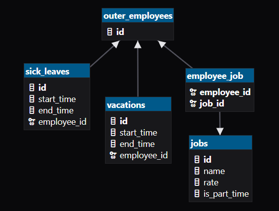

# Вариант 10. Сервис статуса сотрудника

## Команды

### Coздать должность
#### Парамерты передаваемые в запрос
                         
| Параметр     | Пояснение                          | Обязательность | Тип               |      Инвариант     |
| ---          |    ---                             | ---            | ---               |         ---        |
| name         | название должности                 | +              | String            | В пределах 255 символов |
| rate         | ставка                             | +              | i32 (minor units) | не меньше минимума определенного законодательством |
| is_part_time | флаг для совместительной должности | +              | bool              |          -         |

### Добавление должностей сотруднику по ID 
#### Парамерты передаваемые в запрос

| Параметр     | Пояснение                                                 | Обязательность | Тип               |      Инвариант                 |
| ---          |    ---                                                    | ---            | ---               |         ---                    |
| job_ids      | идентификаторы должностей добавляемых сотруднику          | +              | [i64]     | не пустой, значения уникальные |
| employee_id  | идентификатор сотрудника                                  | +              | i64            |          -                     |

### Отправить сотрудника в отпуск 
#### Парамерты передаваемые в запрос

| Параметр     |        Пояснение         | Обязательность | Тип         |      Инвариант          |
| ---          |            ---           | ---            | ---         |         ---             |
| employee_id  | идентификатор сотрудника |        +       | i64      | -                       |
| start_time   | Время начала отпуска     |        +       | TimestampTZ | -                       |
| end_time     | Время концы отпуска      |        +       | TimestampTZ | Больше чем время начала |

### Отправить сотрудника на больничный 
#### Парамерты передаваемые в запрос

| Параметр     | Пояснение                          | Обязательность | Тип               |      Инвариант          |
| ---          |    ---                             | ---            | ---               |         ---             |
| employee_id  | идентификатор сотрудника           |        +       | i64            | -                       |
| start_time   | Время начала больничного           |        +       | TimestampTZ       | -                       |
| end_time     | Время концы конца                  |        +       | TimestampTZ       | Больше чем время начала |

## Запросы

### Получение профиля сотрудника по ID

#### Результат:

| Поле         | Тип                         |
| ---          | ---                         |
| job_ids      | [i64]                       |
| total_rate   | i32 (minor units)           | 
| is_vacate    | bool                        |
| is_sick      | bool                        |
| is_part_time | bool                        |

### Получение истории больничных сотрудника по ID

#### Результат: список структур

| Поле       | Тип         |
| ---        | ---         |
| start_time | TimestampTZ |
| end_time   | TimestampTZ |
| is_active  | bool        |

### Получение истории отпусков по ID

#### Результат: список структур

| Поле       | Тип         |
| ---        | ---         |
| start_time | TimestampTZ |
| end_time   | TimestampTZ |
| is_active  | bool        |

### Получение свободных должностей доступных сотруднику по ID

#### Результат: список структур

| Поле | Тип |
| --- | --- |
| id   | i64    |
| name | String |
| rate | i32 (minor units) | 
| is_part_time | bool |

# ER-диаграмма

