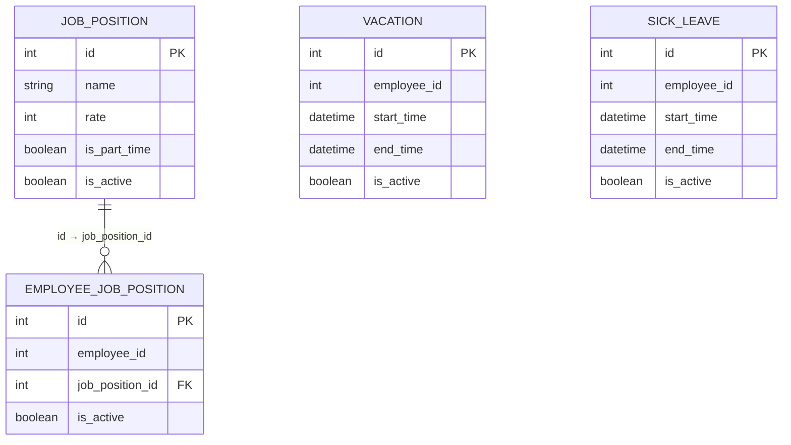

# Вариант 10. Сервис статуса сотрудника (Employee Status Service)

### 1. Должность (Job Position)

#### 1.1 Добавить должность

**Информация для создания:**

| Параметр | Пояснение | Обязательность | Тип | Ограничение | Значение по умолчанию |
|----------------|-----------|----------------|-----|-------------|----------------------|
| name | название должности | + | String | длина ≤ 255, уникальное | - |
| rate | ставка | + | Int32 (minor units) | > 0 | - |
| is_part_time | флаг для совместительной должности | + | Bool | - | - |

**Уникальные комбинации параметров:** name

**Информация при успешном создании:**

| Параметр | Тип |
|----------------|-----|
| id | Int64 |
| is_active | Bool |

HTTP Response со статусом 201

#### 1.2 Изменить должность по ID

**Информация для изменения:**

| Параметр | Пояснение | Обязательность | Тип | Ограничение |
|----------------|-----------|----------------|-----|-------------|
| name | название должности | - | String | длина ≤ 255, уникальное |
| rate | ставка | - | Int32 (minor units) | > 0 |
| is_part_time | флаг для совместительной должности | - | Bool | - |

**Информация при успешном изменении:**

| Параметр | Тип |
|----------------|-----|
| id | Int64 |

HTTP Response со статусом 200

#### 1.3 Удалить должность по ID (мягкое удаление)
- **Возвращаемое значение:** `is_deleted: true` если запись найдена, иначе `is_deleted: false`

HTTP Response со статусом 200

#### 1.4 Получить должность по ID

**Возвращаемая информация:**

| Параметр | Пояснение | Тип |
|----------------|-----------|-----|
| id | идентификатор | Int64 |
| name | название | String |
| rate | ставка | Int32 (minor units) |
| is_part_time | совместительная должность | Bool |
| is_active | активна ли должность | Bool |

HTTP Response со статусом 200

#### 1.5 Получить список должностей

**Параметры запроса:**

| Параметр | Пояснение | Тип |
|----------------|-----------|-----|
| is_active | фильтр по активности | Bool |
| is_part_time | фильтр по совместительности | Bool |
| name_contains | поиск по части названия | String |
| limit | ограничение количества | Int32 |
| offset | смещение для пагинации | Int32 |

**Возвращаемый список:**

| Параметр | Тип |
|----------------|-----|
| id | Int64 |
| name | String |
| rate | Int32 (minor units) |
| is_part_time | Bool |
| is_active | Bool |

HTTP Response со статусом 200

---

### 2. Должности сотрудника (Employee Job Position)

#### 2.1 Добавить должности сотруднику

**Информация для создания:**

| Параметр | Пояснение | Обязательность | Тип | Ограничение |
|----------------|-----------|----------------|-----|-------------|
| employee_id | идентификатор сотрудника | + | Int64 | - |
| job_position_ids | идентификаторы должностей | + | Int64[] | не пустой, уникальные значения в рамках сотрудника |

**Информация при успешном создании:**

| Параметр | Тип |
|----------------|-----|
| ids | Int64[] |

HTTP Response со статусом 201

#### 2.2 Удалить должность у сотрудника по ID (мягкое удаление)
- **Возвращаемое значение:** `is_deleted: true` если запись найдена, иначе `is_deleted: false`

HTTP Response со статусом 200
---

### 3. Отпуск (Vacation)

#### 3.1 Создать отпуск для сотрудника

**Информация для создания:**

| Параметр | Пояснение | Обязательность | Тип | Ограничение |
|----------------|-----------|----------------|-----|-------------|
| employee_id | идентификатор сотрудника | + | Int64 | - |
| start_time | время начала отпуска | + | Timestamp | - |
| end_time | время окончания отпуска | + | Timestamp | > start_time |

**Информация при успешном создании:**

| Параметр | Тип |
|----------------|-----|
| id | Int64 |
| is_active | Bool |

HTTP Response со статусом 201

#### 3.2 Изменить отпуск по ID (мягкое удаление не предусмотрено для изменения)

**Информация для изменения:**

| Параметр | Пояснение | Обязательность | Тип | Ограничение |
|----------------|-----------|----------------|-----|-------------|
| start_time | время начала отпуска | - | Timestamp | - |
| end_time | время окончания отпуска | - | Timestamp | > start_time |

**Информация при успешном изменении:**

| Параметр | Тип |
|----------------|-----|
| id | Int64 |

HTTP Response со статусом 200

#### 3.3 Удалить отпуск по ID (мягкое удаление)

- **Возвращаемое значение:** `is_deleted: true` если запись найдена, иначе `is_deleted: false`

HTTP Response со статусом 200

---

### 4. Больничный (Sick Leave)

#### 4.1 Создать больничный для сотрудника

**Информация для создания:**

| Параметр | Пояснение | Обязательность | Тип | Ограничение |
|----------------|-----------|----------------|-----|-------------|
| employee_id | идентификатор сотрудника | + | Int64 | - |
| start_time | время начала больничного | + | Timestamp | - |
| end_time | время окончания больничного | + | Timestamp | > start_time |

**Информация при успешном создании:**

| Параметр | Тип |
|----------------|-----|
| id | Int64 |
| is_active | Bool |

HTTP Response со статусом 201

#### 4.2 Изменить больничный по ID

**Информация для изменения:**

| Параметр | Пояснение | Обязательность | Тип | Ограничение |
|----------------|-----------|----------------|-----|-------------|
| start_time | время начала больничного | - | Timestamp | - |
| end_time | время окончания больничного | - | Timestamp | > start_time |

**Информация при успешном изменении:**

| Параметр | Тип |
|----------------|-----|
| id | Int64 |

HTTP Response со статусом 200

#### 4.3 Удалить больничный по ID (мягкое удаление)
- **Возвращаемое значение:** `is_deleted: true` если запись найдена, иначе `is_deleted: false`

HTTP Response со статусом 200

---

## Запросы

### 5. Получить общий профиль сотрудника по ID

**Параметры запроса:**

| Параметр | Пояснение | Тип |
|----------------|-----------|-----|
| employee_id | идентификатор сотрудника (Path параметр) | Int64 |

**Возвращаемая информация:**

| Параметр | Пояснение | Тип |
|----------------|-----------|-----|
| job_position_ids | идентификаторы должностей сотрудника | Int64[] |
| total_rate | суммарная ставка | Int32 (minor units) |
| is_vacation | находится ли в отпуске сейчас | Bool |
| is_sick | находится ли на больничном сейчас | Bool |
| is_part_time | имеет ли совместительную должность | Bool |

### 6. Получить историю больничных сотрудника по ID

**Параметры запроса:**

| Параметр | Пояснение | Тип |
|----------------|-----------|-----|
| employee_id | идентификатор сотрудника (Path параметр) | Int64 |

**Возвращаемый список:**

| Параметр | Пояснение | Тип |
|----------------|-----------|-----|
| start_time | время начала | Timestamp |
| end_time | время окончания | Timestamp |
| is_active | активна ли запись | Bool |

### 7. Получить историю отпусков сотрудника по ID

**Параметры запроса:**

| Параметр | Пояснение | Тип |
|----------------|-----------|-----|
| employee_id | идентификатор сотрудника (Path параметр) | Int64 |

**Возвращаемый список:**

| Параметр | Пояснение | Тип |
|----------------|-----------|-----|
| start_time | время начала | Timestamp |
| end_time | время окончания | Timestamp |
| is_active | активна ли запись | Bool |

### 8. Получить должности, доступные сотруднику по ID

**Параметры запроса:**

| Параметр | Пояснение | Тип |
|----------------|-----------|-----|
| employee_id | идентификатор сотрудника (Path параметр) | Int64 |

**Возвращаемый список:**

| Параметр | Пояснение | Тип |
|----------------|-----------|-----|
| id | идентификатор должности | Int64 |
| name | название | String |
| rate | ставка | Int32 (minor units) |
| is_part_time | совместительная должность | Bool |

## ER-диаграмма

