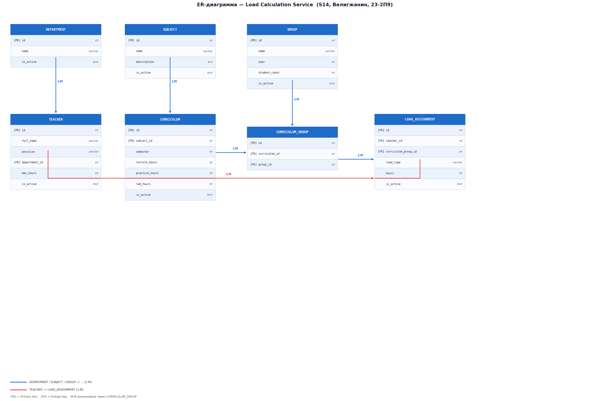

# S14 — Load Calculation Service (Сервис расчёта нагрузки)

**Вариант:** 14  
**Фамилия:** Велигжанин  
**Группа:** 23-2П9  
**Оценка:** 3

---

## 1. Требования

### 1.1 Описание сервиса

Сервис автоматически рассчитывает, сколько часов должен отработать преподаватель в семестре, исходя из учебных планов и количества групп.

### 1.2 Функционал сервиса

1. Управление **кафедрами** — создание, просмотр, редактирование, деактивация.
2. Управление **преподавателями** — привязка к кафедре, хранение максимально допустимого количества часов на семестр.
3. Управление **дисциплинами** — справочник учебных предметов с описанием.
4. Управление **учебными группами** — хранение названия, года обучения и количества студентов.
5. Управление **учебными планами** — дисциплина в семестре с разбивкой часов по типам занятий (лекции, практики, лабораторные).
6. **Назначение учебного плана на группы** — транзитивная таблица, реализующая связь многие ко многим между учебным планом и учебными группами.
7. **Назначение нагрузки преподавателям** — привязка преподавателя к конкретной группе в рамках учебного плана с указанием типа занятий и количества часов.
8. **Расчёт суммарной нагрузки** преподавателя за семестр с проверкой превышения установленного лимита часов.

### 1.3 Правила валидации данных

| Поле | Правило |
|------|---------|
| `name` (Department, Subject) | Строка, 2–255 символов, уникальное значение в таблице |
| `full_name` (Teacher) | Строка, 2–255 символов |
| `position` | Одно из: `Ассистент`, `Старший преподаватель`, `Доцент`, `Профессор` |
| `max_hours` (Teacher) | Целое число, 1 ≤ `max_hours` ≤ 2000 |
| `name` (Group) | Строка, 2–50 символов, уникальное значение в таблице |
| `year` (Group) | Целое число, 1 ≤ `year` ≤ 6 |
| `student_count` (Group) | Целое число, > 0 |
| `semester` (Curriculum) | Целое число, 1 ≤ `semester` ≤ 12 |
| `lecture_hours` | Целое число, ≥ 0 |
| `practice_hours` | Целое число, ≥ 0 |
| `lab_hours` | Целое число, ≥ 0 |
| `lecture_hours + practice_hours + lab_hours` | Сумма должна быть > 0 |
| `load_type` (LoadAssignment) | Одно из: `lecture`, `practice`, `lab` |
| `hours` (LoadAssignment) | Целое число, > 0 |

---

## 2. ER-диаграмма

---

## 3. Сущности

---

### 3.1 Department (Кафедра)

#### Добавить Department

Информация, требуемая для создания:

| Параметр | Пояснение | Обязательность | Тип | Ограничение | Значение по умолчанию |
|----------|-----------|:--------------:|-----|-------------|:---------------------:|
| name | Название кафедры | Да | string | 2–255 символов, уникальное | — |

Информация, возвращаемая в случае удачного создания:

| Параметр | Тип |
|----------|-----|
| id | int |
| name | string |
| is_active | bool |

---

#### Изменить Department по ID

Информация, требуемая для изменения по ID:

| Параметр | Пояснение | Обязательность | Тип | Ограничение | Значение по умолчанию |
|----------|-----------|:--------------:|-----|-------------|:---------------------:|
| name | Новое название кафедры | Нет | string | 2–255 символов, уникальное | — |

Информация, возвращаемая в случае удачного изменения:

| Параметр | Тип |
|----------|-----|
| id | int |
| name | string |
| is_active | bool |

---

#### Удаление Department по ID

Вернёт `True`, если кафедра была закрыта (удалена), иначе вернёт `False`. Фактически запись из БД не удаляется, а реализуется через булевое поле `is_active`.

---

#### Получить Department по ID

Информация, возвращаемая в случае удачного поиска по ID:

| Параметр | Пояснение | Тип |
|----------|-----------|-----|
| id | Идентификатор кафедры | int |
| name | Название кафедры | string |
| is_active | Активна ли кафедра | bool |

---

#### Получить список Department по заданным параметрам

Информация, требуемая для получения списка:

| Параметр | Пояснение | Тип | Описание |
|----------|-----------|-----|----------|
| name | Поиск по названию | string | Фильтрация по вхождению подстроки |
| is_active | Статус активности | bool | `true` — только активные, `false` — деактивированные |

Информация, возвращаемая в виде списка:

| Параметр | Тип |
|----------|-----|
| id | int |
| name | string |
| is_active | bool |

---

### 3.2 Teacher (Преподаватель)

#### Добавить Teacher

Информация, требуемая для создания:

| Параметр | Пояснение | Обязательность | Тип | Ограничение | Значение по умолчанию |
|----------|-----------|:--------------:|-----|-------------|:---------------------:|
| full_name | ФИО преподавателя | Да | string | 2–255 символов | — |
| position | Должность | Да | string | Одно из: `Ассистент`, `Старший преподаватель`, `Доцент`, `Профессор` | — |
| department_id | Идентификатор кафедры | Да | int | Существующая запись в `departments` | — |
| max_hours | Максимум часов в семестре | Да | int | 1–2000 | — |

Информация, возвращаемая в случае удачного создания:

| Параметр | Тип |
|----------|-----|
| id | int |
| full_name | string |
| position | string |
| department_id | int |
| max_hours | int |
| is_active | bool |

---

#### Изменить Teacher по ID

Информация, требуемая для изменения по ID:

| Параметр | Пояснение | Обязательность | Тип | Ограничение | Значение по умолчанию |
|----------|-----------|:--------------:|-----|-------------|:---------------------:|
| full_name | ФИО преподавателя | Нет | string | 2–255 символов | — |
| position | Должность | Нет | string | Одно из: `Ассистент`, `Старший преподаватель`, `Доцент`, `Профессор` | — |
| department_id | Идентификатор кафедры | Нет | int | Существующая запись в `departments` | — |
| max_hours | Максимум часов в семестре | Нет | int | 1–2000 | — |

Информация, возвращаемая в случае удачного изменения:

| Параметр | Тип |
|----------|-----|
| id | int |
| full_name | string |
| position | string |
| department_id | int |
| max_hours | int |
| is_active | bool |

---

#### Удаление Teacher по ID

Вернёт `True`, если преподаватель был закрыт (удалён), иначе вернёт `False`. Фактически запись из БД не удаляется, а реализуется через булевое поле `is_active`.

---

#### Получить Teacher по ID

Информация, возвращаемая в случае удачного поиска по ID:

| Параметр | Пояснение | Тип |
|----------|-----------|-----|
| id | Идентификатор преподавателя | int |
| full_name | ФИО | string |
| position | Должность | string |
| department_id | Идентификатор кафедры | int |
| department_name | Название кафедры | string |
| max_hours | Максимум часов в семестре | int |
| is_active | Активен ли преподаватель | bool |

---

#### Получить список Teacher по заданным параметрам

Информация, требуемая для получения списка:

| Параметр | Пояснение | Тип | Описание |
|----------|-----------|-----|----------|
| full_name | Поиск по ФИО | string | Фильтрация по вхождению подстроки |
| position | Должность | string | Точное совпадение |
| department_id | Идентификатор кафедры | int | Точное совпадение |
| is_active | Статус активности | bool | `true` — только активные |

Информация, возвращаемая в виде списка:

| Параметр | Тип |
|----------|-----|
| id | int |
| full_name | string |
| position | string |
| department_id | int |
| department_name | string |
| max_hours | int |
| is_active | bool |

---

### 3.3 Subject (Дисциплина)

#### Добавить Subject

Информация, требуемая для создания:

| Параметр | Пояснение | Обязательность | Тип | Ограничение | Значение по умолчанию |
|----------|-----------|:--------------:|-----|-------------|:---------------------:|
| name | Название дисциплины | Да | string | 2–255 символов, уникальное | — |
| description | Описание дисциплины | Нет | string | Произвольный текст | `""` |

Информация, возвращаемая в случае удачного создания:

| Параметр | Тип |
|----------|-----|
| id | int |
| name | string |
| description | string |
| is_active | bool |

---

#### Изменить Subject по ID

Информация, требуемая для изменения по ID:

| Параметр | Пояснение | Обязательность | Тип | Ограничение | Значение по умолчанию |
|----------|-----------|:--------------:|-----|-------------|:---------------------:|
| name | Название дисциплины | Нет | string | 2–255 символов, уникальное | — |
| description | Описание дисциплины | Нет | string | Произвольный текст | — |

Информация, возвращаемая в случае удачного изменения:

| Параметр | Тип |
|----------|-----|
| id | int |
| name | string |
| description | string |
| is_active | bool |

---

#### Удаление Subject по ID

Вернёт `True`, если дисциплина была закрыта (удалена), иначе вернёт `False`. Фактически запись из БД не удаляется, а реализуется через булевое поле `is_active`.

---

#### Получить Subject по ID

Информация, возвращаемая в случае удачного поиска по ID:

| Параметр | Пояснение | Тип |
|----------|-----------|-----|
| id | Идентификатор дисциплины | int |
| name | Название дисциплины | string |
| description | Описание | string |
| is_active | Активна ли дисциплина | bool |

---

#### Получить список Subject по заданным параметрам

Информация, требуемая для получения списка:

| Параметр | Пояснение | Тип | Описание |
|----------|-----------|-----|----------|
| name | Поиск по названию | string | Фильтрация по вхождению подстроки |
| is_active | Статус активности | bool | `true` — только активные |

Информация, возвращаемая в виде списка:

| Параметр | Тип |
|----------|-----|
| id | int |
| name | string |
| description | string |
| is_active | bool |

---

### 3.4 Group (Учебная группа)

#### Добавить Group

Информация, требуемая для создания:

| Параметр | Пояснение | Обязательность | Тип | Ограничение | Значение по умолчанию |
|----------|-----------|:--------------:|-----|-------------|:---------------------:|
| name | Название группы | Да | string | 2–50 символов, уникальное | — |
| year | Год обучения | Да | int | 1–6 | — |
| student_count | Количество студентов | Да | int | > 0 | — |

Информация, возвращаемая в случае удачного создания:

| Параметр | Тип |
|----------|-----|
| id | int |
| name | string |
| year | int |
| student_count | int |
| is_active | bool |

---

#### Изменить Group по ID

Информация, требуемая для изменения по ID:

| Параметр | Пояснение | Обязательность | Тип | Ограничение | Значение по умолчанию |
|----------|-----------|:--------------:|-----|-------------|:---------------------:|
| name | Название группы | Нет | string | 2–50 символов, уникальное | — |
| year | Год обучения | Нет | int | 1–6 | — |
| student_count | Количество студентов | Нет | int | > 0 | — |

Информация, возвращаемая в случае удачного изменения:

| Параметр | Тип |
|----------|-----|
| id | int |
| name | string |
| year | int |
| student_count | int |
| is_active | bool |

---

#### Удаление Group по ID

Вернёт `True`, если группа была закрыта (удалена), иначе вернёт `False`. Фактически запись из БД не удаляется, а реализуется через булевое поле `is_active`.

---

#### Получить Group по ID

Информация, возвращаемая в случае удачного поиска по ID:

| Параметр | Пояснение | Тип |
|----------|-----------|-----|
| id | Идентификатор группы | int |
| name | Название группы | string |
| year | Год обучения | int |
| student_count | Количество студентов | int |
| is_active | Активна ли группа | bool |

---

#### Получить список Group по заданным параметрам

Информация, требуемая для получения списка:

| Параметр | Пояснение | Тип | Описание |
|----------|-----------|-----|----------|
| name | Поиск по названию | string | Фильтрация по вхождению подстроки |
| year | Год обучения | int | Точное совпадение |
| is_active | Статус активности | bool | `true` — только активные |

Информация, возвращаемая в виде списка:

| Параметр | Тип |
|----------|-----|
| id | int |
| name | string |
| year | int |
| student_count | int |
| is_active | bool |

---

### 3.5 Curriculum (Учебный план)

#### Добавить Curriculum

Информация, требуемая для создания:

| Параметр | Пояснение | Обязательность | Тип | Ограничение | Значение по умолчанию |
|----------|-----------|:--------------:|-----|-------------|:---------------------:|
| subject_id | Идентификатор дисциплины | Да | int | Существующая запись в `subjects` | — |
| semester | Номер семестра | Да | int | 1–12 | — |
| lecture_hours | Часы лекций | Нет | int | ≥ 0 | `0` |
| practice_hours | Часы практик | Нет | int | ≥ 0 | `0` |
| lab_hours | Часы лабораторных | Нет | int | ≥ 0 | `0` |

**Уникальные комбинации:** (`subject_id`, `semester`) — пара должна быть уникальной в таблице.

**Дополнительное ограничение:** сумма `lecture_hours + practice_hours + lab_hours` должна быть > 0.

Информация, возвращаемая в случае удачного создания:

| Параметр | Тип |
|----------|-----|
| id | int |
| subject_id | int |
| subject_name | string |
| semester | int |
| lecture_hours | int |
| practice_hours | int |
| lab_hours | int |
| total_hours | int |
| is_active | bool |

---

#### Изменить Curriculum по ID

Информация, требуемая для изменения по ID:

| Параметр | Пояснение | Обязательность | Тип | Ограничение | Значение по умолчанию |
|----------|-----------|:--------------:|-----|-------------|:---------------------:|
| lecture_hours | Часы лекций | Нет | int | ≥ 0 | — |
| practice_hours | Часы практик | Нет | int | ≥ 0 | — |
| lab_hours | Часы лабораторных | Нет | int | ≥ 0 | — |

Информация, возвращаемая в случае удачного изменения:

| Параметр | Тип |
|----------|-----|
| id | int |
| subject_id | int |
| subject_name | string |
| semester | int |
| lecture_hours | int |
| practice_hours | int |
| lab_hours | int |
| total_hours | int |
| is_active | bool |

---

#### Удаление Curriculum по ID

Вернёт `True`, если учебный план был закрыт (удалён), иначе вернёт `False`. Фактически запись из БД не удаляется, а реализуется через булевое поле `is_active`.

---

#### Получить Curriculum по ID

Информация, возвращаемая в случае удачного поиска по ID:

| Параметр | Пояснение | Тип |
|----------|-----------|-----|
| id | Идентификатор учебного плана | int |
| subject_id | Идентификатор дисциплины | int |
| subject_name | Название дисциплины | string |
| semester | Номер семестра | int |
| lecture_hours | Часы лекций | int |
| practice_hours | Часы практик | int |
| lab_hours | Часы лабораторных | int |
| total_hours | Итого часов | int |
| is_active | Активен ли план | bool |

---

#### Получить список Curriculum по заданным параметрам

Информация, требуемая для получения списка:

| Параметр | Пояснение | Тип | Описание |
|----------|-----------|-----|----------|
| subject_id | Идентификатор дисциплины | int | Точное совпадение |
| semester | Номер семестра | int | Точное совпадение |
| is_active | Статус активности | bool | `true` — только активные |

Информация, возвращаемая в виде списка:

| Параметр | Тип |
|----------|-----|
| id | int |
| subject_id | int |
| subject_name | string |
| semester | int |
| lecture_hours | int |
| practice_hours | int |
| lab_hours | int |
| total_hours | int |
| is_active | bool |

---

### 3.6 CurriculumGroup (Назначение учебного плана на группу)

> Транзитивная таблица, реализующая связь **многие ко многим** между Curriculum и Group.

#### Добавить CurriculumGroup

Информация, требуемая для создания:

| Параметр | Пояснение | Обязательность | Тип | Ограничение | Значение по умолчанию |
|----------|-----------|:--------------:|-----|-------------|:---------------------:|
| curriculum_id | Идентификатор учебного плана | Да | int | Существующая запись в `curricula` | — |
| group_id | Идентификатор учебной группы | Да | int | Существующая запись в `groups` | — |

**Уникальные комбинации:** (`curriculum_id`, `group_id`) — пара должна быть уникальной в таблице.

Информация, возвращаемая в случае удачного создания:

| Параметр | Тип |
|----------|-----|
| id | int |
| curriculum_id | int |
| group_id | int |

---

#### Удаление CurriculumGroup по ID

Вернёт `True`, если связь была удалена, иначе вернёт `False`. Запись удаляется физически только если на неё нет активных `load_assignments`.

---

#### Получить CurriculumGroup по ID

Информация, возвращаемая в случае удачного поиска по ID:

| Параметр | Пояснение | Тип |
|----------|-----------|-----|
| id | Идентификатор записи | int |
| curriculum_id | Идентификатор учебного плана | int |
| subject_name | Название дисциплины | string |
| semester | Номер семестра | int |
| group_id | Идентификатор группы | int |
| group_name | Название группы | string |

---

#### Получить список CurriculumGroup по заданным параметрам

Информация, требуемая для получения списка:

| Параметр | Пояснение | Тип | Описание |
|----------|-----------|-----|----------|
| curriculum_id | Идентификатор учебного плана | int | Точное совпадение |
| group_id | Идентификатор учебной группы | int | Точное совпадение |
| semester | Номер семестра | int | Фильтрация через связанный Curriculum |

Информация, возвращаемая в виде списка:

| Параметр | Тип |
|----------|-----|
| id | int |
| curriculum_id | int |
| subject_name | string |
| semester | int |
| group_id | int |
| group_name | string |

---

### 3.7 LoadAssignment (Назначение нагрузки)

#### Добавить LoadAssignment

Информация, требуемая для создания:

| Параметр | Пояснение | Обязательность | Тип | Ограничение | Значение по умолчанию |
|----------|-----------|:--------------:|-----|-------------|:---------------------:|
| teacher_id | Идентификатор преподавателя | Да | int | Существующая запись в `teachers` | — |
| curriculum_group_id | Идентификатор записи план — группа | Да | int | Существующая запись в `curriculum_groups` | — |
| load_type | Тип занятия | Да | string | Одно из: `lecture`, `practice`, `lab` | — |
| hours | Количество часов | Да | int | > 0 | — |

**Уникальные комбинации:** (`teacher_id`, `curriculum_group_id`, `load_type`) — тройка должна быть уникальной в таблице.

Информация, возвращаемая в случае удачного создания:

| Параметр | Тип |
|----------|-----|
| id | int |
| teacher_id | int |
| teacher_name | string |
| curriculum_group_id | int |
| load_type | string |
| hours | int |
| is_active | bool |

---

#### Изменить LoadAssignment по ID

Информация, требуемая для изменения по ID:

| Параметр | Пояснение | Обязательность | Тип | Ограничение | Значение по умолчанию |
|----------|-----------|:--------------:|-----|-------------|:---------------------:|
| hours | Новое количество часов | Нет | int | > 0 | — |

Информация, возвращаемая в случае удачного изменения:

| Параметр | Тип |
|----------|-----|
| id | int |
| teacher_id | int |
| teacher_name | string |
| curriculum_group_id | int |
| load_type | string |
| hours | int |
| is_active | bool |

---

#### Удаление LoadAssignment по ID

Вернёт `True`, если назначение было закрыто (удалено), иначе вернёт `False`. Фактически запись из БД не удаляется, а реализуется через булевое поле `is_active`.

---

#### Получить LoadAssignment по ID

Информация, возвращаемая в случае удачного поиска по ID:

| Параметр | Пояснение | Тип |
|----------|-----------|-----|
| id | Идентификатор назначения | int |
| teacher_id | Идентификатор преподавателя | int |
| teacher_name | ФИО преподавателя | string |
| curriculum_group_id | Идентификатор записи план — группа | int |
| subject_name | Название дисциплины | string |
| group_name | Название группы | string |
| semester | Номер семестра | int |
| load_type | Тип занятия | string |
| hours | Количество часов | int |
| is_active | Активно ли назначение | bool |

---

#### Получить список LoadAssignment по заданным параметрам

Информация, требуемая для получения списка:

| Параметр | Пояснение | Тип | Описание |
|----------|-----------|-----|----------|
| teacher_id | Идентификатор преподавателя | int | Точное совпадение |
| curriculum_group_id | Идентификатор записи план — группа | int | Точное совпадение |
| load_type | Тип занятия | string | Точное совпадение |
| semester | Номер семестра | int | Фильтрация через связанный Curriculum |
| is_active | Статус активности | bool | `true` — только активные |

Информация, возвращаемая в виде списка:

| Параметр | Тип |
|----------|-----|
| id | int |
| teacher_id | int |
| teacher_name | string |
| subject_name | string |
| group_name | string |
| semester | int |
| load_type | string |
| hours | int |
| is_active | bool |
