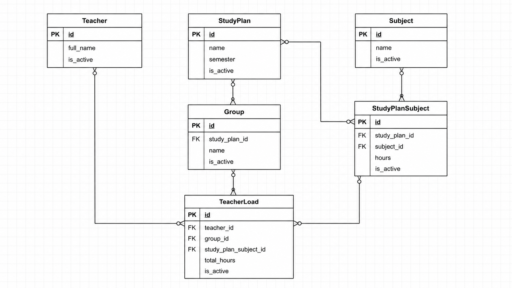

# Вариант 14: Load Calculation Service (Сервис расчета нагрузки)

## Добавить преподавателя (Teacher)

Информация требуемая для создания преподавателя:

| Параметр   | Пояснение         | Обязательность | Тип    | Ограничение      | Значение по умолчанию |
| ---------- | ----------------- | -------------- | ------ | ---------------- | --------------------- |
| name       | ФИО преподавателя | Обязательно    | String | max 100 символов | —                     |
| department | Кафедра           | Обязательно    | String | max 50 символов  | —                     |

Информация возвращаемая в случае удачного создания преподавателя:

| Параметр   | Тип     |
| ---------- | ------- |
| id         | Integer |
| name       | String  |
| department | String  |
| is_active  | Boolean |

## Добавить учебный план (Curriculum)

Информация требуемая для создания учебного плана:

| Параметр    | Пояснение              | Обязательность | Тип     | Ограничение      | Значение по умолчанию |
| ----------- | ---------------------- | -------------- | ------- | ---------------- | --------------------- |
| course_name | Название курса         | Обязательно    | String  | max 100 символов | —                     |
| total_hours | Общее количество часов | Обязательно    | Integer | >0               | —                     |

Информация возвращаемая в случае удачного создания учебного плана:

| Параметр    | Тип     |
| ----------- | ------- |
| id          | Integer |
| course_name | String  |
| total_hours | Integer |
| is_active   | Boolean |

## Добавить группу (Group)

Информация требуемая для создания группы:

| Параметр      | Пояснение         | Обязательность | Тип     | Ограничение     | Значение по умолчанию |
| ------------- | ----------------- | -------------- | ------- | --------------- | --------------------- |
| name          | Название группы   | Обязательно    | String  | max 50 символов | —                     |
| curriculum_id | ID учебного плана | Обязательно    | Integer | >0              | —                     |
| semester      | Семестр           | Обязательно    | Integer | 1–12            | —                     |

Информация возвращаемая в случае удачного создания группы:

| Параметр      | Тип     |
| ------------- | ------- |
| id            | Integer |
| name          | String  |
| curriculum_id | Integer |
| semester      | Integer |
| is_active     | Boolean |

## Назначение преподавателя на группу (TeacherGroup)

Информация требуемая для назначения преподавателя на группу:

| Параметр       | Пояснение        | Обязательность | Тип     | Ограничение | Значение по умолчанию |
| -------------- | ---------------- | -------------- | ------- | ----------- | --------------------- |
| teacher_id     | ID преподавателя | Обязательно    | Integer | >0          | —                     |
| group_id       | ID группы        | Обязательно    | Integer | >0          | —                     |
| assigned_hours | Назначенные часы | Обязательно    | Integer | >=0         | —                     |

Уникальная комбинация: `teacher_id` + `group_id`

Информация возвращаемая в случае удачного назначения:

| Параметр       | Тип     |
| -------------- | ------- |
| id             | Integer |
| teacher_id     | Integer |
| group_id       | Integer |
| assigned_hours | Integer |
| is_active      | Boolean |

## Изменение назначения преподавателя по ID

Информация требуемая для изменения:

| Параметр       | Пояснение        | Обязательность | Тип     | Ограничение |
| -------------- | ---------------- | -------------- | ------- | ----------- |
| assigned_hours | Назначенные часы | Не обязательно | Integer | >=0         |
| teacher_id     | ID преподавателя | Не обязательно | Integer | >0          |
| group_id       | ID группы        | Не обязательно | Integer | >0          |

Информация возвращаемая в случае удачного изменения:

| Параметр       | Тип     |
| -------------- | ------- |
| id             | Integer |
| teacher_id     | Integer |
| group_id       | Integer |
| assigned_hours | Integer |
| is_active      | Boolean |

## Удаление назначения преподавателя по ID

Реализуется через логическое удаление (`is_active = False`). Возвращает `True`, если запись была активна и стала неактивной, иначе `False`.

## Получить назначение преподавателя по ID

Возвращает только активные записи. Если запись не найдена или неактивна, возвращается 404.

| Параметр       | Пояснение         | Тип     |
| -------------- | ----------------- | ------- |
| id             | ID записи         | Integer |
| teacher_id     | ID преподавателя  | Integer |
| group_id       | ID группы         | Integer |
| assigned_hours | Назначенные часы  | Integer |
| is_active      | Статус активности | Boolean |

## Получить список назначений по параметрам

Информация требуемая для фильтрации:

| Параметр   | Пояснение         | Необязательно | Тип     | Ограничение |
| ---------- | ----------------- | ------------- | ------- | ----------- |
| teacher_id | ID преподавателя  | Да            | Integer | >0          |
| group_id   | ID группы         | Да            | Integer | >0          |
| is_active  | Статус активности | Да            | Boolean | —           |

Информация возвращаемая в виде списка:

| Параметр       | Тип     |
| -------------- | ------- |
| id             | Integer |
| teacher_id     | Integer |
| group_id       | Integer |
| assigned_hours | Integer |
| is_active      | Boolean |

## ER-диаграмма

---