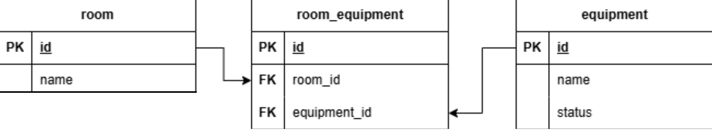

### Room Equipment Service (Сервис оборудования)
#### Вариант 18

#### Создание оборудования в кабинете
| Параметр | Пояснение | Обязательность | Тип | Ограничение | Значение по умолчанию |
|---|---|---|---|---|---|
| equipment_ids | id единиц оборудования | обязательно | Список целых чисел | больше 0 | |
| room_id | id кабинета | обязательно | целое число | Больше 0 | |

В случае удачного создания оборудования в кабинете возвращается:
| Параметр | Тип |
|---|---|
| equipment_ids | Список целых чисел |
| room_id | целое число |

#### Изменить список оборудования в кабинете
| Параметр | Пояснение | Обязательность | Тип | Ограничение | Значение по умолчанию |
|---|---|---|---|---|---|
| equipment_ids | id единиц оборудования | обязательно | Список целых чисел | больше 0 | |
| room_id | id кабинета | обязательно | целое число | Больше 0 | |

Спиосок оборудования полностью перезаписывается

В случае удачного изменения списка оборудования в кабинете возвращается:
| Параметр | Тип |
|---|---|
| equipment_ids | Список целых чисел |
| room_id | целое число |

#### Изменить статус оборудования кабинета
| Параметр | Пояснение | Обязательность | Тип | Ограничение | Значение по умолчанию |
|---|---|---|---|---|---|
| equipment_id | id оборудования | обязательно | целое число | Больше 0 | |
| status | статус оборудования | необязательно | булевое значение | | True |

В случае удачного изменения статуса оборудования возвращается:
| Параметр | Тип |
|---|---|
| status | булевое значение |
| equipment_id | целое число |

#### Удалить оборудование в кабинете по id оборудования
Вернёт, если кабинет был успешно удалён
| Параметр | Тип | Сообщение |
|---|---|---|
| message | Строка | Оборудование удалено |

Вернет ошибку, если оборудование не удалено
| Параметр | Тип | Сообщение |
|---|---|---|
| message | Строка | Оборудование не найдено или не удалось удалить |

#### Получить оборудование кабинета по номеру кабинета
Информация возвращаемая в случае удачного получения
| Параметр | Тип |
|---|---|
| equipment_ids | Список целых чисел |
| room_id | целое число |
| status | булевое значение |

#### Получить список кабинетов по параметрам
| Параметр | Тип | Описание |
|---|---|---|
| room_num | целое число | Частичный поиск без учёта регистра |
| equipment_ids | список целых чисел | Поиск по одному или нескольким id оборудования |
| status | булевое значение | Поиск по статусу доступности кабинета |

Информация возвращаемая в случае удачного получения в виде списка кабинетов
| Параметр | Тип |
|---|---|
| equipment_ids | Список целых чисел |
| room_id | целое число |
| status | булевое значение |

#### ERD

