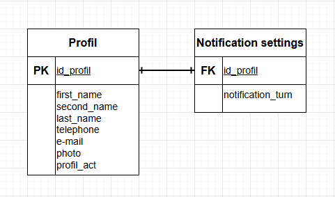

### Вариант №2. Сервис профилей.
#### Добавить профиль.

Информация требуемая для создания профиля:
| Параметр | Пояснение | Обязательность | Тип | Ограничение | Значение по умолчанию |
|---|---|---|---|---|---|
| first_name | Фамилия | Обязательно | Строка |  |  |
| second_name | Имя | Обязательно | Строка |  |  |
| last_name | Отчество | Не обязательно | Строка |  | 'NULL' |
| telephone | Номер телефона | Обязательно | Строка | Формат записи:'+7(000)000-00-00' |  |
| email | Электронная почта | Обязательно | Строка |  |  |
| path_to_photo | Путь к фотографии | Обязательно | Строка |  |  |

Информация возращаемая пользователю при удачном добавлении профиля:
| Параметр | Тип |
|---|---|
| id_profil | Целое число |
| first_name | Строка |
| second_name | Строка |
| last_name | Строка |
| telephone | Строка |
| email | Строка |
| path_to_photo | Строка |

#### Изменить профиль по ID.

Входные параметры:
| Параметр | Пояснение | Обязательность | Тип | Ограничение | Значение по умолчанию |
|---|---|---|---|---|---|
| first_name | Фамилия | Не обязательно | Строка |  |  |
| second_name | Имя | Не обязательно | Строка |  |  |
| last_name | Отчество | Не обязательно | Строка |  |  |
| telephone | Номер телефона | Не обязательно | Строка | Формат записи:'+7 (000) 000-00-00' |  |
| email | Электронная почта | Не обязательно | Строка |  |  |
| path_to_photo | Путь к фотографии | Не обязательно | Строка |  |  |

Выходные параметры:
| Параметр | Тип |
|---|---|
| id_profil | Целое число |
| first_name | Строка |
| second_name | Строка |
| last_name | Строка |
| telephone | Строка |
| email | Строка |
| path_to_photo | Строка |

#### Удаление профиля по ID.
Сообщение возвращаемое пользователю если профиль был закрыт (удален):
| Параметр | Тип | Сообщение |
|---|---|---|
| message | Строка | Данный профиль был закрыт (удален) |

При неудачном закрытии (удалении) профиля пользователю будет возвращено сообщение ошибка:
| Параметр | Тип | Сообщение |
|---|---|---|
| message | Строка | Данный профиль не был найден или не удалось его закрыть (удалить) |

Фактически запись из БД не удаляется, данная функция реализуется через буллевое поле 'is_active' принимающее значения: 'True' - профиль активный; 'False' - профиль был закрыт (удален).

#### Получить информацию о профиле по ID.
Информация возвращаемая пользователю в случае удачного поиска профиля по ID:
| Параметр | Тип |
|---|---|
| id_profil | Целое число |
| first_name | Строка |
| second_name | Строка |
| last_name | Строка |
| telephone | Строка |
| email | Строка |
| path_to_photo | Строка |
| is_active | Буллевое значение |

#### Получить список профилей по параметрам.
Параметры запроса:
| Параметр | Пояснение | Тип | Описание |
|---|---|---|---|
| first_name | Фамилия | Строка | Получение списка профилей с значением определенной фамилии |
| second_name | Имя | Строка | Получение списка профилей с значением определенного имени |
| last_name | Отчество | Строка | Получение списка профилей с значением определенного отчества |
| telephone | Номер телефона | Строка | Получение списка профилей с значением определенного телефона |
| email | Электронная почта | Строка | Получение списка профилей с значением определенной электронной почты |
| is_active | Активность профиля | Буллевое значение | "True" - активные профили; "False" - неактивные профили |

При удачном запросе вернуть пользователю список профилей с информацией:
| Параметр | Тип |
|---|---|
| id_profil | Целое число |
| first_name | Строка |
| second_name | Строка |
| last_name | Строка |
| telephone | Строка |
| email | Строка |
| path_to_photo | Строка |
| is_active | Буллевое значение |

#### Настройки уведомлений по ID.
Информация требуемая для настройки уведомлений:
| Параметр | Пояснение | Обязательность | Тип | Ограничение | Значение по умолчанию |
|---|---|---|---|---|---|
|notification_turn | Включение уведомлений | Обязательно | Буллевое значение |  | 'True' |

Информация возвращаемая пользователю в случае удачной настройки уведомлений:
| Параметр | Тип |
|---|---|
|id_profil | ID профиля | Целое число |
|notification_turn | Включение уведомлений | Буллевое значение |

#### ER-диаграмма.

