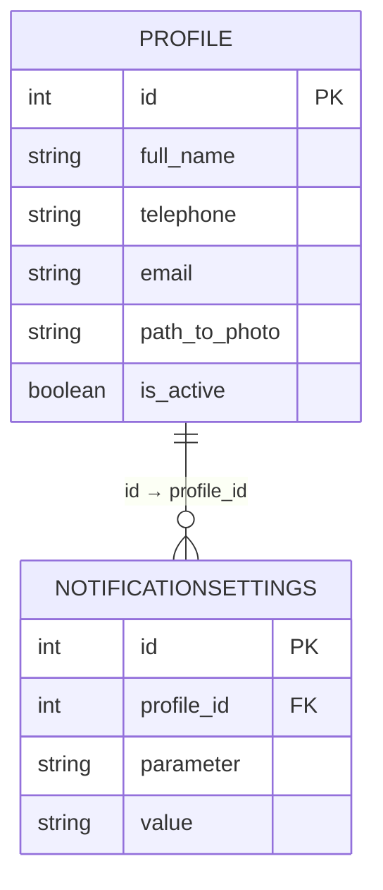

### Вариант №2. Profile Service (Сервис профилей)

#### Добавить профиль.

Информация требуемая для создания профиля:
| Параметр | Пояснение | Обязательность | Тип | Ограничение | Значение по умолчанию |
|---|---|---|---|---|---|
| full_name | ФИО | Обязательно | Строка | Максимальная длина = 255 |  |
| telephone | Номер телефона | Обязательно | Строка | Максимальная длина = 10, должно быть уникальным. |  |
| email | Электронная почта | Обязательно | Строка | Максимальная длина = 255, должно быть уникальным. |  |
| path_to_photo | Путь к фотографии | Обязательно | Строка | Максимальная длина = 255 |  |

Информация возращаемая пользователю при удачном добавлении профиля:
| Параметр | Тип |
|---|---|
| id | Целое число |
| full_name | Строка |
| telephone | Строка |
| email | Строка |
| path_to_photo | Строка |
| is_active | boolean |

Уникальных комбинаций параметров нет.

#### Изменить профиль по ID.

Входные параметры:
| Параметр | Пояснение | Обязательность | Тип | Ограничение |
|---|---|---|---|---|
| full_name | ФИО | Не обязательно | Строка | Максимальная длина = 255 |
| telephone | Номер телефона | Не обязательно | Строка | Максимальная = 10, должно быть уникальным. |
| email | Электронная почта | Не обязательно | Строка | Максимальная длина = 255, должно быть уникальным. |
| path_to_photo | Путь к фотографии | Не обязательно | Строка | Максимальная длина = 255 |

Выходные параметры:
| Параметр | Тип |
|---|---|
| id | Целое число |
| full_name | Строка |
| telephone | Строка |
| email | Строка |
| path_to_photo | Строка |
| is_active | boolean |

#### Удаление профиля по ID.
Фактически запись из БД не удаляется, данная функция реализуется через буллевое поле 'is_active' принимающее значения: 'True' - профиль активный; 'False' - профиль был закрыт (удален).

#### Получить информацию о профиле по ID.
Информация возвращаемая пользователю в случае удачного поиска профиля по ID:
| Параметр | Пояснение | Тип |
|---|---|---|
| id | Идентификатор | Целое число |
| full_name | ФИО | Строка |
| telephone | Телефон | Строка |
| email | Электронная почта | Строка |
| path_to_photo | Путь к фотографии | Строка |
| is_active | Активность профиля | boolean |

#### Получить список профилей по параметрам.
Параметры запроса:
| Параметр | Пояснение | Тип |
|---|---|---|
| full_name | ФИО | Строка |
| is_active | Активность профиля | boolean |

При удачном запросе вернуть пользователю список профилей с информацией:
| Параметр | Тип |
|---|---|
| id | Целое число |
| full_name | Строка |
| telephone | Строка |
| email | Строка |
| path_to_photo | Строка |
| is_active | boolean |

### Настройки уведомлений.
Информация хранимая для настройки уведомлений:
| Параметр | Пояснение | Обязательность | Тип | Ограничение | Значение по умолчанию |
|---|---|---|---|---|---|
| parameter | Параметр | Обязательно | Строка | Максимальная длина = 255 |  |
| value | Значение | Обязательно | Строка | Максимальная длина = 255 |  |

#### Получить информацию о настройках уведомлений.
Информация возвращаемая пользователю о настройках уведомлений:
| Параметр | Тип |
|---|---|
| id | Целое число |
| parameter | Строка |
| value | Строка |

Настройки уведомлений по определяют измененные (отличающиеся от исходных) параметры и их значения персонализации (состояний) уведомлений для каждого конкретного пользователя.

#### ER-диаграмма

```mermaid
erDiagram
    PROFILE {
        int id PK
        string full_name
        string telephone
        string email
        string path_to_photo
        boolean is_active
    }
    NOTIFICATIONSETTINGS {
        int id PK
        int profile_id FK
        string parameter
        string value
    }

    PROFILE ||--o{ NOTIFICATIONSETTINGS : "id → profile_id"
```
