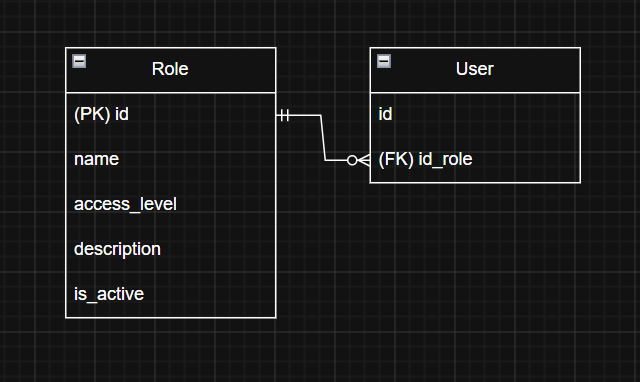

### Вариант №3. Role Service (Сервис ролей).
#### Добавить роль.

Информация, требуемая для создания роли:
| Параметр | Пояснение | Обязательность | Тип | Ограничение | Значение по умолчанию |
|---|---|---|---|---|---|
| role name | Название роли (Админ, Директор, Завуч, Преподаватель, Студент, Родитель) | Обязательно | Строка | — | — |
| access level | Уровень доступа роли (чем выше уровень роли, тем больше прав)| Обязательно | Целое число | больше 0 (от 1 до n) | 1 |
| role description | Описание роли (доступный функционал, пример для роли Студент: регистрация/авторизация, сброс пароля, просмотр расписания и т.д.)| Не обязательно | Строка | — | `NULL` |

Комбинация параметров: `role name` и `access level ` должна быть уникальной

Информация, возращаемая в случае удачного создания роли:
| Параметр | Тип |
|---|---|
| id | Целое число |
| role name | Строка |
| access level | Целое число |
| role description | Строка |

#### Измененить роль по ID.

Информация, требуемая для изменения роли по ID:
| Параметр | Пояснение | Обязательность | Тип | Ограничение | Значение по умолчанию |
|---|---|---|---|---|---|
| id | id роли | Обязательно | Целое число | больше 0 | `NULL` |

Информация, возращаемая в случае удачного изменения роли:
| Параметр | Тип |
|---|---|
| id | Целое число |
| role name | Строка |
| access level | Целое число |
| role description | Строка |

#### Удаление роли по ID.

Вернет истинну (`True`) если роль была закрыта (удалена), иначе ложно (`False`)

#### Получить роли по ID.

Информация, возращаемая в случае удачного поиска роли по ID:
| Параметр | Пояснение | Тип | 
|---|---|---|
| id | id роли | Целое число |
| role name | Название роли (Админ, Директор, Завуч, Преподаватель, Студент, Родитель) | Строка |
| access level | Уровень доступа роли | Целое число |
| role description | Описание роли | Строка |

#### Получить список ролей по заданным параметрам.

Информация, требуемая для получения списка ролей по заданным параметрам:
| Параметр | Пояснение | Тип | Описание |
|---|---|---|---|
| access level | Уровень доступа роли (точное число) | Целое число | ровно "1" |
| access level | Уровень доступа роли (перечисление "больше n") | Целое число | больше "1" |
| access level | Уровень доступа роли (перечисление "меньше n") | Целое число | меньше "6" |

Информация, возвращаемая в виде списка ролей:
| Параметр | Тип |
|---|---|
| id роли | Целое число |
| role name | Строка |

### ER-диаграмма

