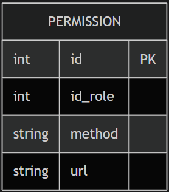

## Вариант №4. Сервис разрешений (Permission Service)

### Назначение сервиса
Сервис предоставляет возможность управления правами доступа для ролей пользователей. Каждое право определяет, какое действие (HTTP метод + URL шаблон) разрешено для конкретной роли.

---

## Добавить разрешение

### Информация, требуемая для создания разрешения

| Параметр | Обязательность | Тип | Ограничение | Значение по умолчанию |
|----------|----------------|-----|-------------|----------------------|
| `id_role` | Обязательно | Целое число | от 1 до 6 | |
| `method` | Обязательно | Строка | | |
| `url` | Обязательно | Строка | Поддерживает шаблон `*`| |

### Информация, возвращаемая при успешном создании

| Параметр | Тип |
|----------|-----|
| `status_code` | Целое число (201) |
| `detail` | Строка |
| `id` | Целое число |

---

## Изменить разрешение по ID

### Входные параметры

| Параметр | Обязательность | Тип | Ограничение | Значение по умолчанию |
|----------|----------------|-----|----|----------------------|
| `id` (в URL) | Обязательно | Целое число | | |
| `method` | Не обязательно | Строка | | `None` |
| `url` | Не обязательно | Строка | | `None` |

### Информация, возвращаемая при успешном изменении

| Параметр | Тип |
|----------|-----|
| `status_code` | Целое число (200) |
| `detail` | Строка |
| `id` | Целое число |

---

## Удалить разрешение по ID

**Фактическая реализация:** возвращает HTTP 200 с сообщением об успешном удалении или 404 при отсутствии записи.

---

## Получить разрешение по ID

### Информация, возвращаемая при успешном поиске

| Параметр | Пояснение | Тип |
|----------|-----------|-----|
| `id` | Идентификатор разрешения | Целое число |
| `id_role` | Идентификатор роли | Целое число |
| `method` | HTTP метод | Строка |
| `url` | URL шаблон | Строка |

---

## Получить список разрешений по ID роли

### Входные параметры (query)

| Параметр | Тип | Описание |
|----------|-----|----------|
| `role_id` | Целое число | ID роли (1-6). Необязательный |

**Примечание:** если `role_id` не передан, возвращаются все разрешения, сгруппированные по ролям.

### Информация, возвращаемая в виде списка разрешений

Без `role_id` (группировка по ролям):

| Параметр | Тип |
|----------|-----|
| `{role_id}` | Список объектов разрешений для данной роли |

С `role_id`:

| Параметр | Тип |
|----------|-----|
| `id` | Целое число |
| `method` | Строка |
| `url` | Строка |

---

## ER-диаграмма

## Точки входа REST API

| Метод    | Путь                           | Назначение                                        |
|----------|--------------------------------|---------------------------------------------------|
| `GET`    | `/permissions/`                | Получить все разрешения, сгруппированные по ролям |
| `GET`    | `/permissions/{role_id}/`      | Получить разрешения для конкретной роли           |
| `GET`    | `/permissions/{permission_id}` | Получить конкретное разрешение                    |
| `POST`   | `/permissions/{role_id}/`      | Создать новое разрешение для роли                 |
| `PATCH`  | `/permissions/{id}/`           | Обновить разрешение по ID                         |
| `DELETE` | `/permissions/{id}/`           | Удалить разрешение по ID                          |

---

## UX приложения (Desktop на Tkinter)

### Функционал интерфейса

| Элемент           | Действие |
|-------------------|----------|
| Кнопка "Добавить" | Открывает форму для создания нового разрешения |
| Таблица           | Отображает все разрешения: ID, Роль, Метод, Ссылка |
| ЛКМ по строке     | Открывает форму редактирования выбранного разрешения |
| ПКМ по строке     | Удаляет выбранное разрешение (с подтверждением) |

### Форма добавления/редактирования

- **Роль:** Выпадающий список (1-6)
- **Метод:** Выпадающий список (GET, POST, PUT, DELETE)
- **Ссылка:** Текстовое поле для ввода URL шаблона
- **Кнопка "Сохранить"** — сохраняет изменения в БД

---

