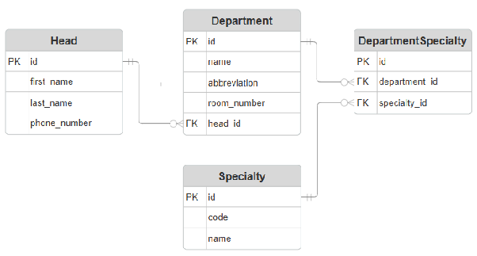

**Вариант №5. Сервис факультетов/отделений**

**Добавить отделение**  
Информация, требуемая для создания группы

| Параметр | Обязательность | Тип | Ограничение | Значение по умолчанию |
| :---- | :---- | :---- | :---- | :---- |
| Наименование | Обязательно | Строка | Уникальное значение |  |
| Аббревиатура | Обязательно | Строка | Уникальное, только заглавные буквы |  |
| Номер кабинета | Обязательно | Целое число | Больше 0 |  |
| id заведующего | Обязательно | Целое число | Больше 0,  |  |

Уникальные комбинации параметров:

* Наименование должно быть полностью уникальным.  
* Аббревиатура должна быть полностью уникальной.

Информация, возвращаемая в случае удачного создания отделения:

| Параметр | Тип |
| :---- | :---- |
| id отделения | Целое число |
| Наименование | Строка |
| Аббревиатура | Строка |
| Номер кабинета | Целое число |
| id заведующего | Целое число |

**Изменить отделение по ID**  
Входные параметры

| Параметр | Обязательность | Тип | Ограничение | Значение по умолчанию |
| :---- | :---- | :---- | :---- | :---- |
| id заведующего | Обязательно | Целое число | Больше 0 | NULL |

Выходные параметры

| Параметр | Тип |
| :---- | :---- |
| id отделения | Целое число |
| Наименование | Строка |
| Аббревиатура | Строка |
| Номер кабинета | Целое число |
| id заведующего | Целое число |
| Имя и фамилия заведующего | Строка |
| Количество специальностей | Целое число |
| Список ID специальностей | Список целых чисел |

**Удаление отделения по ID**  
Вернет True, если отделение было закрыто (удалено), иначе вернет False.

**Получить отделение по ID**  
Информация, возвращаемая в случае удачного поиска отделения по ID:

| Параметр | Тип |
| :---- | :---- |
| id отделения | Целое число |
| Наименование | Строка |
| Аббревиатура | Строка |
| Номер кабинета | Целое число |
| id заведующего | Целое число |
| Имя и фамилия заведующего | Строка |
| Количество специальностей | Целое число |
| Список ID специальностей | Список целых чисел |

Получить список отделений по заданным параметрам:

| Параметр | Тип | Описание |
| :---- | :---- | :---- |
| Наименование | Строка | Поиск по точному совпадению или подстроке |
| Аббревиатура | Строка | Поиск по точному совпадению |
| id заведующего | Целое число | Фильтрация отделений по конкретному заведующему |

Информация, возвращаемая в виде списка отделений:

| Параметр | Тип |
| :---- | :---- |
| id отделения | Целое число |
| Наименование | Строка |
| Аббревиатура | Строка |

**ER-Диаграмма**  

