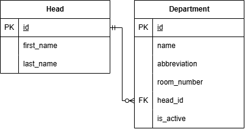

**Вариант №5. Сервис факультетов/отделений**

**Добавить отделение**  
Информация, требуемая для создания отделения

| Параметр | Обязательность | Тип | Ограничение | Значение по умолчанию | Пояснение |
| :---- | :---- | :---- | :---- | :---- | :---- |
| name | Обязательно | Строка | Макс. 150 символов | | Полное наименование отделения |
| abbreviation | Обязательно | Строка | Макс. 20 символов | | Краткая аббревиатура отделения |
| room_number | Обязательно | Целое число | Больше 0 | | Номер кабинета отделения |
| head_id | Обязательно | Целое число | | | Идентификатор заведующего |

Уникальные комбинации параметров:

* name должно быть полностью уникальным.  
* abbreviation должно быть полностью уникальным.

Информация, возвращаемая в случае удачного создания отделения:

| Параметр | Тип |
| :---- | :---- |
| id | Целое число |
| name | Строка |
| abbreviation | Строка |
| room_number | Целое число |
| head_id | Целое число |
| is_active | Логический |

Поле is_active не передаётся при создании сущности, а возвращается только в ответе.

**Изменить отделение по ID**  
Входные параметры

| Параметр | Обязательность | Тип | Ограничение | Значение по умолчанию | Пояснение |
| :---- | :---- | :---- | :---- | :---- | :---- |
| head_id | Обязательно | Целое число | | | Идентификатор заведующего |
| id | Обязательно | Целое число | | | Уникальный идентификатор отделения |
| name | Опционально | Строка | Макс. 150 символов | | Полное наименование отделения |
| abbreviation | Опционально | Строка | Макс. 20 символов | | Краткая аббревиатура отделения |
| room_number | Опционально | Целое число | Больше 0 | | Номер кабинета отделения |

Выходные параметры

| Параметр | Тип |
| :---- | :---- |
| id | Целое число |
| name | Строка |
| abbreviation | Строка |
| room_number | Целое число |
| head_id | Целое число |
| is_active | Логический |

**Удаление отделения по ID**  
Информация, возвращаемая при удалении отделения:

| Возвращаемое значение | Тип |
| :---- | :---- | 
| True | Логический | 
| False | Логический | 

**Получить отделение по ID**  
Информация, возвращаемая в случае удачного поиска отделения по ID:

| Параметр | Тип | Пояснение |
| :---- | :---- | :---- |
| id | Целое число | Уникальный идентификатор отделения |
| name | Строка | Полное наименование отделения (уникальное) |
| abbreviation | Строка | Краткая аббревиатура отделения |
| room_number | Целое число | Номер кабинета отделения |
| head_id | Целое число | Идентификатор заведующего отделением |
| is_active | Логический | Статус активности отделения |

Получить список отделений по заданным параметрам:

| Параметр | Тип | Пояснение |
| :---- | :---- | :---- |
| name | Строка | Поиск по точному совпадению или подстроке (опционально) |
| abbreviation | Строка | Поиск по точному совпадению (опционально) |
| head_id | Целое число | Фильтрация отделений по конкретному заведующему (опционально) |

Информация, возвращаемая в виде списка отделений:

| Параметр | Тип |
| :---- | :---- |
| id | Целое число |
| name | Строка |
| abbreviation | Строка |
| room_number | Целое число |
| head_id | Целое число |
| is_active | Логический |

**ER-диаграмма**  
