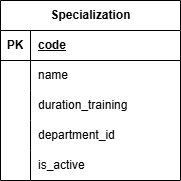

### Вариант №6. Сервис Специальностей.
#### Добавить Специальность.

Информация требуемая для создания специальности
| Параметр | Обязательность | Тип | Ограничение | Значение по умолчанию |
|---|---|---|---|---|
| code | Обязательно | Строка | вида `NN.NN.NN` (цифры, разделённые точками) |  |
| name | Обязательно | Строка |  |  |
| duration_training | Обязательно | Целое число | больше 0 |  |
| id_department | Не обязательно | Целое число | больше 0 |  |

Информация возвращаемая в случае удачного создания специальности
| Параметр | Тип |
|---|---|
| code | Строка | 
| name | Строка |
| duration_training | Целое число |
| id_department | Целое число |

#### Изменить специальность по Шифру специальностей

Информация требуемая для изменения специальности
| Параметр | Обязательность | Тип | Ограничение | Значение по умолчанию |
|---|---|---|---|---|
| name | Не обязательно | Строка |  |  |
| duration_training | Не обязательно | Целое число | больше 0 |  |
| id_department | Не обязательно | Целое число | больше 0 |  |

Информация возвращаемая в случае удачного изменения специальности
| Параметр | Тип |
|---|---|
| code | Строка | 
| name | Строка |
| duration_training | Целое число |
| id_department | Целое число |

#### Удалить специальность по Шифру специальностей

Вернет сообщение о том, что такая-то специальность удалена, иначе выдаст сообщение о том, что такая специальность не существует

#### Получить специальность по шифру специальностей

Информация возвращаемая в случае удачного поиска специальности
| Параметр | Тип |
|---|---|
| code | Строка | 
| name | Строка |
| duration_training | Целое число |
| id_department | Целое число |

#### Получить список специальностей по заданным параметрам

Информация требуемая для получения списка специальностей
| Параметр | Тип | Описание |
|---|---|---|
| name | Строка | Поиск будет частичный, не учитывая регистр |
| duration_training | Целое число | "1" - равно 1, "1,3" - от 1 до 3, "1," - от 1, ",3" - до 3. Включительно |
| id_department | Целое число | "1" - равно 1, "1,3" - от 1 до 3, "1," - от 1, ",3" - до 3. Включительно |

Информация возвращается в виде списка специальностей
| Параметр | Тип |
|---|---|
| code | Строка | 
| name | Строка |
| duration_training | Целое число |
| id_department | Целое число |

### ER-диаграмма

