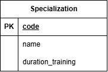

### Вариант №6. Сервис Специальностей.
#### Добавить Специальность.

Информация требуемая для создания специальности
| Параметр | Обязательность | Тип | Ограничение | Значение по умолчанию |
|---|---|---|---|---|
| Шифр специальности | Обязательно | Строка | вида `NN.NN.NN` (цифры, разделённые точками) |  |
| Название специальности| Обязательно | Строка |  |  |
| Срок обучения в месяцах | Обязательно | Целое число | больше 0 |  |

Информация возвращаемая в случае удачного создания специальности
| Параметр | Тип |
|---|---|
| Шифр специальности | Строка | 
| Название специальности | Строка |
| Срок обучения в месяцах | Целое число |

#### Изменить специальность по Шифру специальностей

Информация требуемая для изменения специальности
| Параметр | Обязательность | Тип | Ограничение | Значение по умолчанию |
|---|---|---|---|---|
| Название специальности | Не обязательно | Строка |  |  |
| Срок обучения в месяцах | Не обязательно | Целое число | больше 0 |  |

Информация возвращаемая в случае удачного изменения специальности
| Параметр | Тип |
|---|---|
| Шифр специальности | Строка | 
| Название специальности | Строка |
| Срок обучения в месяцах | Целое число |

#### Удалить специальность по Шифру специальностей

Вернет сообщение о том, что такая-то специальность удалена, иначе выдаст сообщение о том, что такая специальность не существует

#### Получить специальность по шифру специальностей

Информация возвращаемая в случае удачного поиска специальности
| Параметр | Тип |
|---|---|
| Шифр специальности | Строка | 
| Название специальности | Строка |
| Срок обучения в месяцах | Целое число |

#### Получить список специальностей по заданным параметрам

Информация требуемая для получения списка специальностей
| Параметр | Тип | Описание |
|---|---|---|
| Название специальности | Строка | Поиск будет частичный, не учитывая регистр |
| Срок обучения в месяцах | Целое число | "1" - равно 1, "1,3" - от 1 до 3, "1," - от 1, ",3" - до 3. Включительно |

Информация возвращается в виде списка специальностей
| Параметр | Тип |
|---|---|
| Шифр специальности| Строка | 
| Название специальности | Строка |
| Срок обучения в месяцах | Целое число |

### ER-диаграмма

