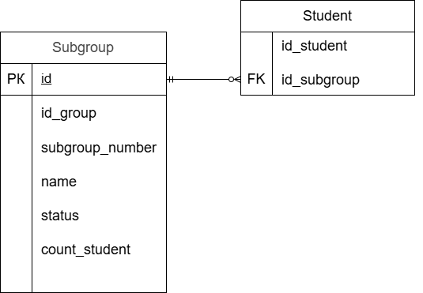

### Вариант №8. Сервис подгрупп. Subgroup Service.
#### Добавить подгруппу.

Информация требуемая для создания подгруппы
| Параметр | Пояснение | Обязательность | Тип | Ограничение | Значение по умолчанию |
|---|---|---|---|---|---|
| id_group | id группы | Обязательно | Целое число | больше 0 |  |
| subgroup_number | Номер подгруппы | Обязательно | Целое число | от 1 |  |
| status | Статус | Обязательно | Булевое начение | 0(False) или 1(True) | 1(True) |

Информация возвращаемая в случае удачного создания подгруппы
| Параметр | Тип |
|---|---|
| id_subgroup | Целое число |
| id_group | Целое число |
| subgroup_number | Целое число |
| name | Строка |
| status | Булевое начение |
| count_student | Целое число |

#### Измененить подгруппу по ID

Информация требуемая для изменения подгруппы
| Параметр | Пояснение | Обязательность | Тип | Ограничение | Значение по умолчанию |
|---|---|---|---|---|---|
| count_student | Количество студентов | Обязательно | Целое число |  |  |

Информация возвращаемая в случае удачного изменения подгруппы
| Параметр | Тип |
|---|---|
| id_subgroup | Целое число |
| id_group | Целое число |
| subgroup_number | Целое число |
| name | Строка |
| status | Булевое начение |
| count_student | Целое число |

#### Удаление подгруппы по ID

Вернет, если подгуппа была закрыта(удалена)
| Параметр | Тип | Сообщение |
|---|---|---|
| message | Строка | Подгруппа удалена(закрыта) |

Вернет ошибку, если подгруппа не закрыта(удалена)
| Параметр | Тип | Сообщение |
|---|---|---|
| message | Строка | Подгруппа не найдена или не удалось закрыть(удалить) |

### Получить подгруппу по ID

Информация возвращаемая в случае удачного поиска подгруппы
| Параметр | Тип |
|---|---|
| id_subgroup | Целое число |
| id_group | Целое число |
| subgroup_number | Целое число |
| name | Строка |
| status | Булевое начение |
| count_student | Целое число |

####  Получить список подгрупп по заданным параметрам

Информация требуемая для получения списка подгрупп
| Параметр |Пояснение | Тип | Описание |
|---|---|---|---|
| id_group | id группы | Целое число | "1" - равно 1 |
| subgroup_number | Номер подгруппы | Целое число | "1" - равно 1 |
| name | Наименование подгруппы | Строка | Поиск по частичному совпадению без учета регистра |
| count_student | Количество студентов | Строка | "1" - равно 1, "1,3" - от 1 до 3, "1," - от 1, ",3" - до 3. Включительно |
| status | Статус | Булевое начение | 0(False) или 1(True) |

Результат содержит только активные подгруппы

Информация возвращается в виде списка подгрупп
| Параметр | Тип |
|---|---|
| id_subgroup | Целое число |
| id_group | Целое число |
| subgroup_number | Целое число |
| name | Строка |
| status | Булевое начение |
| count_student | Целое число |

### ER-диаграмма

