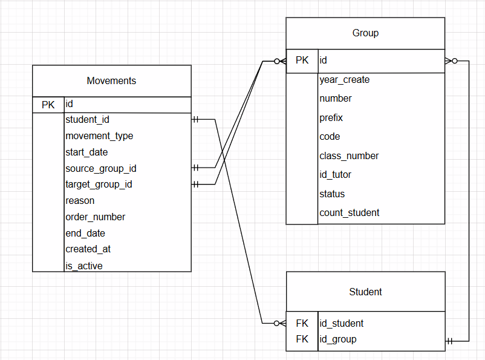

## Вариант 9. Сервис движения студентов

### Добавить движение

Информация требуемая для создания движения студентов

| Параметр  | Пояснение  | Обязательность | Тип | Ограничение | Значение по умолчанию |
|--------------------------|------------------------|----------------|-----|-------------|-----------------------|
| student_id | ID студента | Обязательно | Integer | > 0 | — |
| movement_type | Тип движения | Обязательно | String | expelled, reinstated, transferred, academic_leave, back_from_leave | — |
| start_date | Дата начала движения | Обязательно | Date | формат ГГГГ-ММ-ДД | — |
| source_group_id | ID группы-источника | Условно | Integer | > 0 | — |
| target_group_id | ID группы-назначения | Условно | Integer | > 0 | — |
| reason | Основание движения | Не обязательно | String | max 255 символов | NULL |
| order_number | Номер приказа | Не обязательно | String | max 50 символов | NULL |
| end_date | Дата окончания | Условно | Date | позже start_date | NULL |

Уникальные комбинации параметров: movement_type + student_id + start_date

Информация возвращаемая в случае удачного создания движения студента

| Параметр | Тип |
|--------------------------|-----|
| id | Integer |
| student_id | Integer |
| movement_type | String |
| start_date | Date |
| source_group_id | Integer или NULL |
| target_group_id | Integer или NULL |
| reason | String или NULL |
| order_number | String или NULL |
| end_date | Date или NULL |
| created_at | DateTime |
| is_active | Boolean |

### Изменить движения студента по ID

Информация требуемая для изменения движения студента по ID 

| Параметр | Пояснение  | Обязательность | Тип | Ограничение | Значение по умолчанию |
|--------------------------|------------------------|----------------|-----|-------------|-----------------------|
| movement_type | Тип движения | Не обязательно | String | expelled, reinstated, transferred, academic_leave, back_from_leave | — |
| start_date | Дата начала движения | Не обязательно | Date | формат ГГГГ-ММ-ДД | — |
| source_group_id | ID группы-источника | Не обязательно | Integer | > 0 | — |
| target_group_id | ID группы-назначения | Не обязательно | Integer | > 0 | — |
| reason | Основание движения | Не обязательно | String | max 255 символов | NULL |
| order_number | Номер приказа | Не обязательно | String | max 50 символов | NULL |
| end_date | Дата окончания | Не обязательно | Date | позже start_date | NULL |

Информация возвращаемая в случае удачного изменения движения студента

| Параметр  | Тип |
|--------------------------|-----|
| id | Integer |
| student_id | Integer |
| movement_type | String |
| start_date | Date |
| source_group_id | Integer или NULL |
| target_group_id | Integer или NULL |
| reason | String или NULL |
| order_number | String или NULL |
| end_date | Date или NULL |
| updated_at | DateTime |

### Удалить Movement по ID

Вернет True, если Movement была удалена, иначе вернет False

### Получить информацию о движении студента по ID

Информация возвращаемая в случае удачного поиска движения студента

| Параметр  | Пояснение  | Тип |
|--------------------------|------------------------|-----|
| id | ID записи движения | Integer |
| student_id | ID студента | Integer |
| movement_type | Тип движения | String |
| start_date | Дата начала | Date |
| source_group_id | ID группы-источника | Integer или NULL |
| target_group_id | ID группы-назначения | Integer или NULL |
| reason | Основание | String или NULL |
| order_number | Номер приказа | String или NULL |
| end_date | Дата окончания | Date или NULL |
| created_at | Дата создания записи | DateTime |
| is_active | Активна ли запись | Boolean |

### Получить список движения по заданным параметрам

| Параметр  | Пояснение  | Тип | Описание |
|--------------------------|------------------------|-----|----------|
| student_id | ID студента | Integer | Фильтр по студенту |
| movement_type | Тип движения | String | expelled, reinstated, transferred, academic_leave, back_from_leave |
| source_group_id | ID группы-источника | Integer | Фильтр по исходной группе |
| target_group_id | ID группы-назначения | Integer | Фильтр по целевой группе |
| start_date_from | Начало периода | Date | дата начала не ранее |
| start_date_to | Конец периода | Date | дата начала не позднее |
| is_active | Статус активности | Boolean | true/false |
| limit | Лимит записей | Integer | максимум 100 |
| offset | Смещение | Integer | для пагинации |

Информация возвращается в виде списка движения:

| Параметр  | Тип |
|--------------------------|-----|
| id | Integer |
| student_id | Integer |
| movement_type | String |
| start_date | Date |
| source_group_id | Integer или NULL |
| target_group_id | Integer или NULL |
| reason | String или NULL |
| order_number | String или NULL |
| end_date | Date или NULL |
| is_active | Boolean |

### ER-диаграмма

