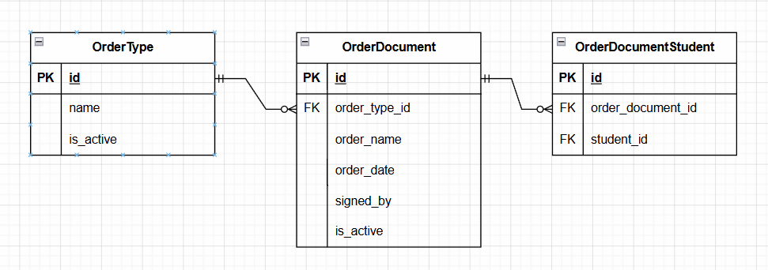

## Вариант 9. Сервис движения студентов

### Добавить тип приказа (OrderType)

Информация требуемая для создания типа приказа

| Параметр | Пояснение | Обязательность | Тип | Ограничение | Значение по умолчанию |
|----------|-----------|----------------|-----|-------------|-----------------------|
| name | Название типа приказа | Обязательно | String | max 50 символов | — |

Информация возвращаемая в случае удачного создания типа приказа

| Параметр | Тип |
|----------|-----|
| id | Integer |
| name | String |
| is_active | Boolean |

### Добавить содержание приказа (OrderDocument)

Информация требуемая для создания содержания приказа

| Параметр | Пояснение | Обязательность | Тип | Ограничение | Значение по умолчанию |
|----------|-----------|----------------|-----|-------------|-----------------------|
| order_type_id | ID типа приказа | Обязательно | Integer | > 0 | — |
| student_ids | Список ID студентов | Обязательно | List[Integer] | каждый ID > 0 | — |
| order_number | Номер приказа | Обязательно | String | max 50 символов | — |
| order_date | Дата приказа | Обязательно | Date | формат ГГГГ-ММ-ДД | — |
| signed_by | Кто подписал | Обязательно | String | max 100 символов | — |

Уникальная комбинация: `order_number` + `order_type_id`

Информация возвращаемая в случае удачного создания содержания приказа

| Параметр | Тип |
|----------|-----|
| id | Integer |
| order_type_id | Integer |
| student_ids | List[Integer] |
| order_number | String |
| order_date | Date |
| signed_by | String |
| is_active | Boolean |

### Изменить содержание приказа по ID

Информация требуемая для изменения

| Параметр | Пояснение | Обязательность | Тип | Ограничение |
|----------|-----------|----------------|-----|-------------|
| order_type_id | ID типа приказа | Не обязательно | Integer | > 0 |
| student_ids | Список ID студентов | Не обязательно | List[Integer] | каждый ID > 0 |
| order_number | Номер приказа | Не обязательно | String | max 50 символов |
| order_date | Дата приказа | Не обязательно | Date | формат ГГГГ-ММ-ДД |
| signed_by | Кто подписал | Не обязательно | String | max 100 символов |

Информация возвращаемая в случае удачного изменения

| Параметр | Тип |
|----------|-----|
| id | Integer |
| order_type_id | Integer |
| student_ids | List[Integer] |
| order_number | String |
| order_date | Date |
| signed_by | String |
| is_active | Boolean |

В случае, если запись с указанным ID не найдена или данные не прошли валидацию, возвращается соответствующий HTTP-статус 404 (Не найдено) или 422 (Необрабатываемый запрос) с описанием ошибки.

### Удаление содержание приказа по ID

Удаление реализовано через установку флага `is_active = False` (логическое удаление). Повторное логическое удаление не изменяет состояние записи.

Вернет `True`, если `is_active` был изменен с `True` на `False`, иначе вернет `False`.

### Получить содержание приказа по ID

Возвращает информацию только об **активной** (не удалённой) записи. Если запись не найдена или была логически удалена (`is_active = False`), возвращается статус 404 (Не найдено).

| Параметр | Пояснение | Тип |
|----------|-----------|-----|
| id | ID записи | Integer |
| order_type_id | ID типа приказа | Integer |
| order_type_name | Название типа приказа | String |
| student_ids | Список ID студентов | List[Integer] |
| order_number | Номер приказа | String |
| order_date | Дата приказа | Date |
| signed_by | Кто подписал | String |
| is_active | Статус активности записи | Boolean |

### Получить список приказов по параметрам

По умолчанию возвращаются только **активные** (`is_active = True`) записи.

Информация требуемая для получения списка

| Параметр | Пояснение | Тип | Описание |
|----------|-----------|-----|----------|
| order_type_id | ID типа приказа | Integer | Фильтр по типу |
| student_id | ID студента | Integer | Фильтр по студенту (ищет в student_ids) |
| order_date_from | Начало периода | Date | дата приказа не ранее |
| order_date_to | Конец периода | Date | дата приказа не позднее |
| signed_by | Кто подписал | String | Фильтр по подписанту |
| is_active | Фильтр по активности | Boolean | Если не указан, возвращаются только активные записи |

Информация возвращаемая в виде списка

| Параметр | Тип |
|----------|-----|
| id | Integer |
| order_type_id | Integer |
| order_type_name | String |
| student_ids | List[Integer] |
| order_number | String |
| order_date | Date |
| signed_by | String |
| is_active | Boolean |

### Получить список типов приказов

Информация возвращаемая в виде списка

| Параметр | Тип |
|----------|-----|
| id | Integer |
| name | String |
| is_active | Boolean |

## ER-диаграмма

